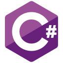

# Hi, I'm Guilherme Ziggiatti

<!-- Typing SVG -->

  

### Core Technology Stack

  
  
  
  
  
  
  
  

  
  
  
  
  
  
  

<table align="center" width="100%" cellspacing="0" cellpadding="0" style="border-collapse: collapse; border: none;">
  <tr>
    <td width="58%" valign="top" style="padding-right:18px;">

<h2>About Me</h2>

I build backend systems, enterprise integrations, and automation for production environments.

My focus is <strong>C#</strong>, <strong>ASP.NET Core</strong>, <strong>Python</strong>, and <strong>FastAPI</strong>, with <strong>Node.js</strong>, <strong>TypeScript</strong>, and <strong>Next.js</strong> for complete delivery across APIs, workflows, and internal tools.

<strong>Core Focus Areas</strong>

<ul>
  <li>Backend APIs and middleware</li>
  <li>ERP and fiscal integrations</li>
  <li>AI-assisted document processing</li>
  <li>Workflow orchestration and automation</li>
  <li>Data validation and synchronization</li>
  <li>Dockerized deployments</li>
</ul>

## Where to Find Me

 

  

---

## Featured Work

### Enterprise & Fiscal Middleware

Middleware for ERPs, fiscal platforms, and government APIs with REST, SOAP, XML, certificates, and resilient validation.

### Intelligent Document Processing

PDF and image pipelines with OCR, multimodal AI, structured extraction, and workflow integration.

### Workflow Automation & Integrations

Automation across n8n, Power Automate, SharePoint, Microsoft 365, APIs, webhooks, files, and databases.

### AI Agents & Operational Systems

AI-assisted automation, internal tooling, document analysis, and operational workflows.

---

## Supporting Capabilities

REST APIs • SOAP • XML • JSON • Webhooks • ETL • OCR • LLM Workflows • Power Automate • SharePoint • Microsoft 365 • Docker Compose • Nginx • GitHub Actions • CI/CD • ERP Integrations • Government APIs

---

## Current Focus

- Enterprise middleware architectures
- SOAP/XML fiscal integrations
- ERP adapters and government APIs
- ICP-Brasil authentication
- Autonomous AI agents
- Enterprise AI automation
- Workflow orchestration systems
- Distributed backend systems
- Operational processing pipelines

---

## Contribution Snake

  <picture>
    <source media="(prefers-color-scheme: dark)" srcset="https://raw.githubusercontent.com/Guilhermeziggiatti/Guilhermeziggiatti/output/github-contribution-grid-snake-dark.svg" />
    <source media="(prefers-color-scheme: light)" srcset="https://raw.githubusercontent.com/Guilhermeziggiatti/Guilhermeziggiatti/output/github-contribution-grid-snake.svg" />
    
  </picture>

---

*Building reliable systems that connect, automate, and scale.*
